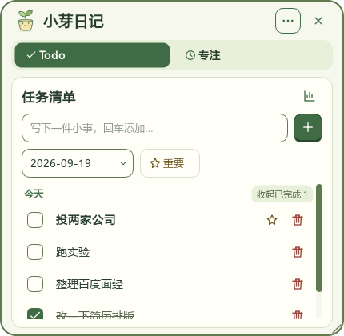
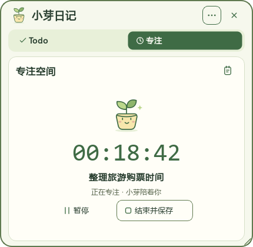
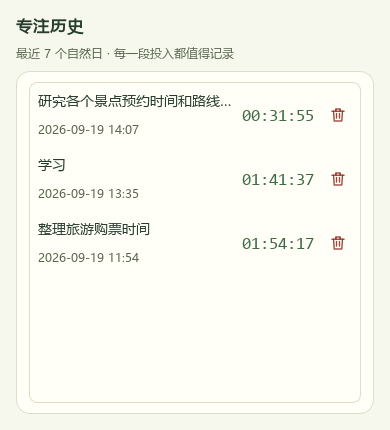
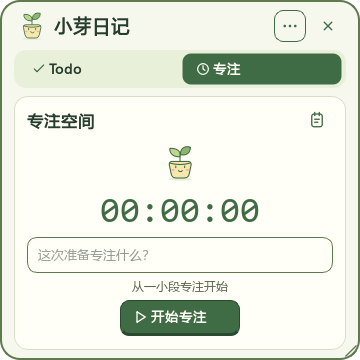
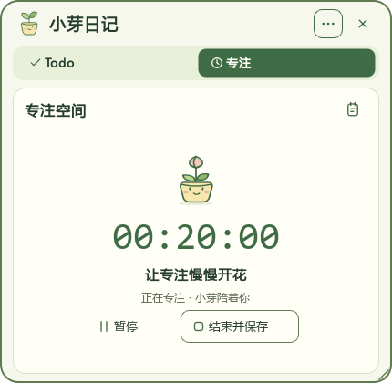
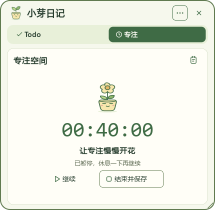

# 小芽手帐：界面重构实施记录

日期：2026-09-19。

改造前版本为 `f8c1849`，用户已确认手动推送到 GitHub。此次修改集中在表现层和素材，任务/专注领域模型、JSON 字段、存储路径及数据保留规则保持原样。

## 已完成的界面

- 奶油白不透明纸面、抹茶绿交互、圆润描边；取消内容区半透明，保留窗口圆角之外的透明区域。
- 顶部小芽标识和双页签胶囊导航，保留窗口拖动、右下角缩放、置顶和开机自启入口。
- Todo 两行添加区、鼠标加号入口、完整日期、重要星标、低强调删除图标、可读的已完成样式。
- 任务正文保留完整数据，显示时省略超长内容，悬停可查看全文并双击编辑；完成任务时短暂显示「又完成一件小事」。
- 专注页使用等宽计时数字、文字操作按钮，以及默认/运行/暂停/保存四种 SVG 小芽状态；结束是正常的保存动作，不再使用危险红色。
- 统计、历史、编辑窗口，菜单、日期日历、空状态、错误提示统一主题。系统弹窗标题栏仍交给 Windows 绘制。
- 统计曲线使用绿色折线、浅绿填充、整数纵轴、查询日期标线和「重置视图」入口；明确标注按任务日期统计。
- 新 SVG/ICO 应用图标和统一线性 SVG 按钮，不依赖彩色 emoji 字体显示核心操作。

## 顺带修复的界面问题

1. 空任务列表多次刷新不再重复创建空状态控件。
2. 专注名称校验信息不会被每 500 ms 的计时刷新立即覆盖。
3. 任务行文字不再用局部深色主题硬编码覆盖公共主题。
4. 长任务和专注名称不再挤走操作按钮；列表刷新时尽量保留滚动位置。
5. `MainWindow` 的控制器类型引用改为只在类型检查时导入，避免单独导入窗口组件时的循环依赖。

## 验证方式

- 自动测试使用临时数据目录，不打开或修改用户 `.data/` 中的任务和专注记录。
- 现有 9 项回归加新增 6 项界面测试，共 15 项通过。
- UI 测试覆盖：重复空列表刷新、添加按钮、仅勾选完成、专注校验、切页计时、暂停保存、最小窗口、长名称、123 小时计时、图标加载、统计查询、编辑校验、日历、菜单和历史空状态。
- 在 `QT_SCALE_FACTOR=1.25 / 1.5 / 2` 下运行界面测试，均通过。它们验证 Qt 缩放布局，不替代多显示器间拖动等真实桌面操作验收。
- 使用 Qt offscreen 渲染查看主要界面截图；离屏环境没有字体发现能力时，测试加载本机微软雅黑和 Consolas。没有随程序分发字体。
- 编译、打包和 EXE 启动检查结果在下方补记。

## 界面预览

截图使用测试示例数据，不包含用户真实任务。

### 任务页

### 专注进行中

### 专注历史

### 任务统计

### 最小尺寸与长时长

其他截图保存在 `docs/screenshots/`，包括编辑、菜单、日历、空状态、暂停和保存反馈。

## 本轮取舍

- 采用静态表情切换和短暂文字反馈，没有加入弹跳动画、循环粒子和养成数据，因此也没有新增动画偏好设置。
- 长名称采用单行省略及全文提示，保证小窗口按钮位置稳定，未采用提案中可选的两行名称布局。
- 拖拽沿用原行为并统一插入提示颜色，未增加跨日期浮动说明；图表保留日期选择器，未新增节点悬浮交互。
- 保留现有服务和仓库，不重新设计任务日期口径、计时或清理规则。

## 首轮构建记录（下方增量更新已替代该产物）

- `compileall` 编译检查通过。
- 使用项目 `todo_desk` 环境（Python 3.11、PySide6 6.11、pyqtgraph 0.14、PyInstaller 6.22）构建成功。
- 新版产物：项目根目录 `DesktopTodoLite.exe`，大小 64,878,197 字节。
- SHA-256：`907F60D8970B75B17573FD2934D7646B32F2C60FBF9024424249C74F5EE2AC06`。
- 检查 EXE 内部资源归档，确认新 SVG/ICO 及四种小芽状态资源均已包含。
- 在沙盒账户的独立临时目录、最小 Windows PATH 下进行离屏启动；程序持续运行 12 秒并进入应用初始化，标准错误日志为空。测试进程因沙盒结束权限限制而单独按完整路径清理，未结束正式程序。
- 用户账户启用了开机自启，因此没有在该账户下启动临时副本，避免把启动项修复到临时路径。用户数据和启动项没有因本次验证而改写。
- 改造前 GitHub 备份为 `f8c1849`，后续界面改动以独立提交保留，不覆盖该历史版本。

使用时关闭旧窗口，再双击项目根目录的新版 EXE。无需迁移 `.data/`。实际 Windows 标题栏、跨屏拖动与开机登录场景仍建议在日常桌面环境中确认。

## 增量更新：小芽日记与专注成长

- 窗口标题、顶部名称和应用显示名称统一改为「小芽日记」。EXE 文件名、内部应用标识及开机自启注册表键保持稳定，避免影响已有数据和启动项。
- 单次专注累计有效时间 `< 20 分钟` 为小芽，`>= 20 分钟且 < 40 分钟` 为花苞，`>= 40 分钟` 为开花。
- 暂停时保留生长阶段，使用同一盆栽的闭眼休息表情；休息时间不计入成长。恢复会话时根据已有累计时长还原，无需新增存储字段。
- 保存后短暂保留当前植物的微笑状态；提示结束或开始新会话时回到小芽。
- 已通过 17 项测试，包括 19:59 / 20:00 / 39:59 / 40:00 边界、暂停两小时不增长、恢复暂停会话、保存与新会话重置，以及所有阶段的 SVG 加载。
- 已检查花苞、开花、开花休息的实际 Qt 渲染截图。
- 增量版本 EXE 已重新构建，归档检查确认六张新增成长素材全部打包；启动方式仍为根目录的 `DesktopTodoLite.exe`。
- 叶片遮挡修正：花苞上移 14 个 SVG 坐标单位、花朵上移 24 个，延长花茎并扩展顶部画布；运行、暂停、保存六张素材同步更新。已查看真实界面渲染，叶片完整露出、顶部无裁切，成长与素材加载两项针对性回归通过。

